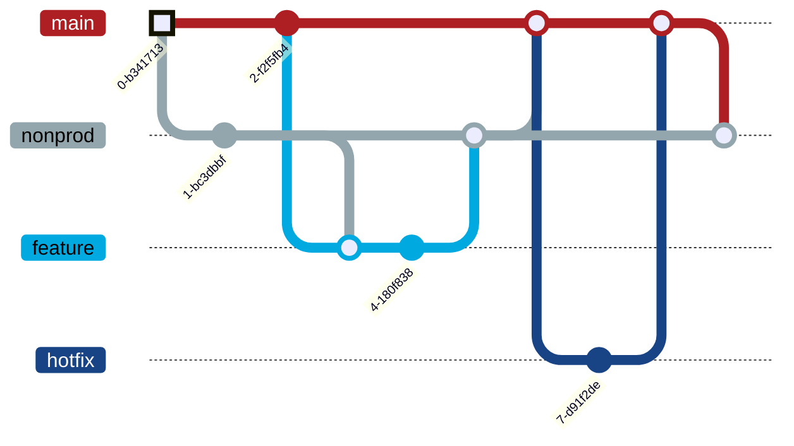

# GaaS-Policy_as_Code

## Here to add a new app?

If you would like to use a new App Shortname in Azure, you will have to create a request through the Runway link below.

https://developer.aa.com/create/templates/default/gaas-app-onboard

This will create a PR against the GaaS-policy-as-Code repo and allow the necessary approvals to be gathered.

We will not be accepting any new shortnames via user created PRs.

## Here for an exception request?

If you are looking for an exception for an existing Azure policy, please reference this guide

[Exception Request Guide](/docs/exceptions/POLICYEXCEPTIONGUIDE.md#requesting-a-policy-exception)

For any questions please reach out to the GaaS team (dl_gaas@aa.com) or post a message in #topic-cloud-governance

## Table of Contents

This repository contains the Policy as Code implementation of policies for our cloud environments. Currently, we are developing the Azure implementation.

1. [Tutorials](#Tutorials)
1. [How To](#How-To)
1. [Reference](#Reference)
1. [Discussion](#Discussion)

## Tutorials

This section will walk you through creating your first change to the Policy as Code.


1. [Policy Tutorial](#Policy-Tutorial)
1. [Initiative Tutorial](#Initiative-Tutorial)

### Policy Creation Tutorial

In this tutorial we will create a policy that will audit (show a report of) all resources within a subscription that are not created in the "eastus" or "westus" data centers.

1. Go to [azure/policies](azure/policies) and create a folder called "myTutorial"
1. Create a file called `policy.json` in the new folder and paste the following

```json
{
  "properties": {
    "displayName": "Region Specification - Tutorial",
    "policyType": "Custom",
    "mode": "All",
    "description": "This is a test of the Policy as Code",
    "metadata": {
      "version": "0.0.1",
      "category": "Location"
    },
    "parameters": {
      "allowedLocations": {
        "type": "Array",
        "metadata": {
          "description": "The list of allowed locations for resources.",
          "displayName": "Allowed locations",
          "strongType": "location"
        },
        "defaultValue": ["eastus"],
        "allowedValues": ["eastus", "westus"]
      }
    },
    "policyRule": {
      "if": {
        "not": {
          "field": "location",
          "in": "[parameters('allowedLocations')]"
        }
      },
      "then": {
        "effect": "audit"
      }
    }
  },
  "id": "",
  "type": "",
  "name": "Myfirstpolicy"
}
```

3. Go to the `policy_definitions.tf` in the [components/policy/definitions](components/policy/definitions) directory and add your module by pasting the following to the top of file.

```terraform
module "tutorial_policy_module" {
  display_name_prefix = var.display_name_prefix
  management_group_id = var.environment == local.production ? "AA_POLICY_TEST" : var.management_group_name
  name_suffix         = var.name_suffix
  path_to_def         = "./azure/policies/myTutorial"
  source              = "../../definitions/policy"
}
```

4. In the same file [components/policy/definitions/policy_definitions.tf](components/policy/definitions/policy_definitions.tf)), add our policy id to the list of existing policy ids. At the bottom, you will find a section called `output "ids"`. This contains the list of existing policies. Add the new policy to the list of existing policy ids. It should looks something like this afterward.

```terraform
output "ids" {
  value = {
    existing_policy1 = module.existing_policy1.id
    existing_policy2 = module.existing_policy2.id
    ...
    # =============================================
    # Add your new policy
    tutorial_policy = module.tutorial_policy_module.id
    # =============================================
  }
}
```

5. Now that the policy definition is all set up, we will assign the policy to a subscription. Go to the folder you created in step one ([azure/policies/myTutorial](azure/policies/myTutorial)) and add a file called "assign.dev.AA_POLICY_TEST.json". Paste the following:

```json
{
  "properties": {
    "displayName": "Region Specification Assignement - Tutorial",
    "policyDefinitionId": "",
    "scope": "/providers/Microsoft.Management/managementGroups/AA_POLICY_TEST",
    "notScopes": [],
    "parameters": {
      "allowedLocations": {
        "value": ["eastus"]
      }
    },
    "metadata": {},
    "enforcementMode": "Default",
    "nonComplianceMessages": []
  },
  "id": "",
  "type": "",
  "name": "Myfirstpolicy_t",
  "location": "eastus"
}
```

6. Go to the [components/policy/assignments/main.tf](components/policy/assignments/main.tf) file and add your policy assignment to the bottom of the file.

```terraform
module "pa_tutorial_policy_assignment" {
  display_name_prefix = var.display_name_prefix
  fileset_filter      = var.fileset_filter
  path_to_dir         = "${var.path_to_policies}/myTutorial"
  policy_desc         = "This is a policy assignment used in the tutorial"
  policy_id           = var.policy_ids.tutorial_policy
  source              = "../../assignments"
}
```

### Initiative Tutorial

In this tutorial, we will set up an initiative and assign it to a subscription. This tutorial assumes that you have already done the [policy tutorial](#Policy-Tutorial).

1. Go to [azure/initiatives](azure/initiatives) and add a new directory "myInitiativeTutorial" and add a `policyset.json` file.
1. Paste the following:

```json
{
  "properties": {
    "displayName": "Region Initiative - Tutorial",
    "policyType": "Custom",
    "description": "This is a tests of policy as code",
    "metadata": {},
    "parameters": {},
    "policyDefinitions": [
      {
        "policyDefinitionReferenceId": "",
        "policyDefinitionId": "",
        "parameters": {}
      }
    ]
  },
  "id": "",
  "type": "Microsoft.Authorization/policySetDefinitions",
  "name": "regioninitiative_t"
}
```

4. Go to the `main.tf` in the [components/initiative/definitions](components/initiative/definitions) directory and add your module to the top of the file.

```terraform
module "initiative_tutorial_module" {
  display_name_prefix = var.display_name_prefix
  management_group_id = var.environment == local.production ? "AA_POLICY_TEST" : var.management_group_id
  name_suffix         = var.name_suffix
  path_to_def         = "${var.path_to_def}/myInitiativeTutorial"
  policy_references = [
    {
      policy_definition_id = var.policy_ids.tutorial_policy
      parameter_values     = can(jsonencode(jsondecode(file("${var.path_to_def}/myInitiativeTutorial/policyset.json")).properties.policyDefinitions[0].parameters)) ? jsonencode(jsondecode(file("${var.path_to_def}/myInitiativeTutorial/policyset.json")).properties.policyDefinitions[0].parameters) : ""
    }
  ]
  source = "../../definitions/initiative"
}
```

5. In the same file add your initiative id to the existing list of existing initiative ids. You will need to do this in order to reference it in the policy initiatives section.

```terraform
output "ids" {
  value = {
    existing_initiative1 = module.existing_initiative1.id
    existing_initiative2 = module.existing_initiative2.id
    ...
    # =============================================
    # Add your new intitiative
    tutorial_initiative = module.initiative_tutorial_module.id
    # =============================================
  }
}
```

6. Now that we have added the initiative definition, we will assign the initiative to a subscription. Go to the [azure/intiatives](azure/initiatives) directory and add a directory called "myInitiative" and add a file called "assign.AA_POLICY_TEST.json" (final file location should be [azure/policies/myInitiative/assign.dev.AA_POLICY_TEST.json](azure/policies/myTutorial/assign.AA_POLICY_TEST.json)). Paste the following:

```json
{
  "properties": {
    "displayName": "Initiative Tutorial",
    "policyDefinitionId": "",
    "scope": "/providers/Microsoft.Management/managementGroups/AA_POLICY_TEST",
    "notScopes": [],
    "parameters": {
      "allowedLocations": {
        "value": ["eastus"]
      }
    },
    "metadata": {},
    "enforcementMode": "Default"
  },
  "id": "",
  "type": "",
  "name": "initiativetutorial",
  "location": "eastus"
}
```

7. Go to the [components/initiative/assignments/initiative_assignments.tf](components/initiative/assignments/initiative_assignments.tf) file and add your initiative assignment to the top of the file.

```terraform
module "pa_tutorial_initiative_assignment" {
  display_name_prefix = var.display_name_prefix
  fileset_filter      = var.fileset_filter
  path_to_dir         = "${var.path_to_initiatives}/myInitiative"
  policy_desc         = "This is a tutorial of the initiative"
  policy_id           = var.policy_ids.tutorial_initiative
  source              = "../../assignments"
}
```

---

## How To

This README will outline how to create your own policy, initiative, and policy assignments.

1. [Workflow](#Workflow)
   - [Policy Updates](#Policy-Updates)
   - [Develop A New Policy](#Develop-a-New-Policy)
1. [Create](#Create)
   - [Create A Policy Definition](#Create-a-Policy-Definition)
   - [Create A Policy Assignment](#Create-a-Policy-Assignment)
   - [Create An Initiative Definition](#Create-an-Initiative-Definition)
   - [Create An Initiative Assignment](#Create-an-Initiative-Assignment)
1. [Remediation](#Remediation-How-To)
   - [Add Roles to Managed Identity](#Add-Roles-to-Managed-Identity)
   - [Create a Remediation Task](#Create-a-Remediation-Task)
1. [Import](#Import)
   - [Import A Policy Definition](#Import-a-Policy-Definition)
   - [Import A Policy Assignment](#Import-a-Policy-/-Initiative-Assignment)
   - [Import An Initiative Definition](#Import-an-Initiative-Definition)

## Workflow

### Policy Updates

To update a policy, you will need to fork the repo. Make any changes you wish in this fork. Once you are happy with the changes, you will need to open an Pull Request. Once the PR is created, a [code owner](.github/CODEOWNERS) will review your request and either approve the PR or request changes to your PR. Once the PR is approved, the changes will be merged into the `main` branch and the changes will be applied automatically via Terraform.

### Develop a New Policy

If you are creating a new policy definition, we require that you perform any development/testing/debugging using the [AA_POLICY_TEST](https://portal.azure.com/#blade/Microsoft_Azure_ManagementGroups/ManagmentGroupDrilldownMenuBlade/overview/tenantId/49793faf-eb3f-4d99-a0cf-aef7cce79dc1/mgId/AA_POLICY_TEST/mgDisplayName/AA_POLICY_TEST/mgCanAddOrMoveSubscription/true/mgParentAccessLevel//defaultMenuItemId/overview/drillDownMode/true) management group. Follow these steps:

1. Clone the repo
1. Create a new branch
1. Add your policy definition to the terraform script (see [How to Create a Policy Definition](#Create-a-Policy-Definition))
1. Add a policy assignment to the development subscription ([aa-ets-nonprod-isolated-1](https://portal.azure.com/#@amrcorp.onmicrosoft.com/resource/subscriptions/55f702f9-17ee-4d42-8da3-3f0bc97c4158/overview) or [aa-ets-nonprod-isolated-2](https://portal.azure.com/#@amrcorp.onmicrosoft.com/resource/subscriptions/34dbcf6f-a9a0-4dd5-af52-1c9b23c30e3a/overview)) and non production, and production environments for your new policy definition (see [How to Create a Policy Assignment](#Create-a-Policy-Assignment)). You will need to have an assignment for each environment in order for the policy to be assigned to a given environment.
1. Open a PR to merge the new policy definition
1. A CODEOWNER will review the PR and apply the changes to our dev environment.
1. Test out the effects in the isolated subscriptions.
1. Make any adjustments you would like (you may need to ask the CODEOWNER to reapply the changes to dev).
1. Once you are happy with the policy changes, the CODEOWNER will review the PR and request any necessary changes.
1. Once the change is approved the changes will be merged into the main branch, and then terraform will update the production environment.

## Create

When creating a new policy definition or assignment, follow these steps.

### Create a Policy Definition

1. Go to [azure/policies](azure/policies) and add a new directory with your policy's name.
1. In your new dirctory add, a `policy.json` file.
1. Add your policy definition in json format to your new `policy.json`. For more information read the documentation on [Azure policy defintions](https://docs.microsoft.com/en-us/azure/governance/policy/concepts/definition-structure). Below is a template you may use for the policy defintion. Please note that you will need to fill out the name, properties.displayName, properties.description, properties.metadata, properties.policyRule, and properties.parameters.

```json
{
  "properties": {
    "displayName": "Name as it appears in Azure when you search for it",
    "policyType": "Custom",
    "mode": "All",
    "description": "This text will appear in the description section",
    "metadata": {
      "contains": "any metadata"
    },
    "parameters": {
      "anyParameters": {
        "type": "type",
        "metadata": {
          "relevant": "metadata"
        },
        "defaultValue": "default",
        "allowedValues": ["allowable", "values"]
      }
    },
    "policyRule": {
      "policyRule": "goes here"
    }
  },
  "id": "",
  "type": "",
  "name": "uniqueName 0-24 characters"
}
```

4. Go to `policy_definitions.tf` in the [components/policy/definitions](components/policy/definitions) directory and add your module.

```terraform
module "your_policy_module" {
  display_name_prefix = var.display_name_prefix
  management_group_id = "target management group"
  name_suffix         = var.name_suffix
  path_to_def         = "./azure/policies/your policy directory you added in step 1"
  source              = "../../definitions/policy"
}
```

5. In the same file add your policy id to the existing list of existing policy ids. You will need to do this in order to reference it in the policy assignments or policy initiatives section.

```terraform
output "ids" {
  value = {
    existing_policy1 = module.existing_policy1.id
    existing_policy2 = module.existing_policy2.id
    ...
    # =============================================
    # Add your new policy
    your_policy = module.your_policy_module.id
    # =============================================
  }
}
```

### Create a Policy Assignment

1. Go to the [azure/policies](azure/policies) directory and, if it does not already exist, add a directory for the policy that you wish to assign.
1. Add a file to the policy folder you just created (or found) and add a file called `assign.{environment (dev | np | p)}.{scope name}.json`. (e.g. `assign.np.aa-eg-nonprod-spoke.json`, or `assign.p.aa-eg-prod-spoke_resource-group1.json`)
1. Copy the following template and fill it in with the relevant information. For details see the Terraform documentation on [policy assignments](https://registry.terraform.io/providers/hashicorp/azurerm/latest/docs/resources/policy_assignment).

```json
{
  "properties": {
    "displayName": "this is the name that will appear when you search for your policy assignment",
    "scope": "this is the group, subscription, or resource group to which you would like this rule to apply",
    "notScopes": [
      "any resources that you would like excluded. This section is usually an empty array"
    ],
    "parameters": {
      "add": "any parameters in json format"
    },
    "metadata": {
      "add": "any metadata you would like in json format"
    },
    "enforcementMode": "Default: 'Default' means this rule will be enforced"
  },
  "identity": {
    "if": "remediation is a part of your policy, you will neeed to provide an identity (in json format) to perform the corrective actions"
  },
  "type": "Microsoft.Authorization/policyAssignments",
  "name": "name of the policy assignment. I recommend just using the policy's name",
  "location": "eastus"
}
```

4. Go to the [components/policy/assignments/policy_assignments.tf](components/policy/assignments/policy_assignments.tf) file and add your policy assignment.

```terraform
module "pa_your_policy_assignment" {
  fileset_filter = var.fileset_filter
  path_to_dir    = "${var.path_to_policies}/{directory you created in step 1}"
  policy_desc    = "description associated with assignment"

  # set the policy id to be either the policy id you exported when you define your policy
  # or hard code the value if the policy is a built in policy
  policy_id   = var.policy_ids.your_policy | "hard code built in policy id"

  # If your assignment does not require remediation, please use the "../../assignments" as the source.
  # If your assignment requires remediation, please use "../../assignments/with remediation" as the source.
  # Most assignments do not require remediation.
  source      = "../../assignments" | "../../assignments/with remediation"
}
```

### Create an Initiative Definition

1. Go to [azure/initiatives](azure/initiatives) and add a new directory with your policy's name.
1. In your new dirctory add, a `policyset.json` file.
1. Add your initiative definition resource to your new `policyset.json`. For more information read the Terraform documentation on [initiative definitions](https://registry.terraform.io/providers/hashicorp/azurerm/latest/docs/resources/policy_set_definition). Here is a template.

```json
{
  "properties": {
    "displayName": "Name as it appears in Azure when you search for it",
    "policyType": "Custom",
    "description": "This is a tests of policy as code",
    "metadata": {
      "any": "metadata"
    },
    "parameters": {
      "any": "parameters"
    },
    "policyDefinitions": [
      {
        "policyDefinitionReferenceId": "",
        "policyDefinitionId": "Not read by Terraform",
        "parameters": {
          "thisSection": "can be read later by Terraform"
        }
      }
    ]
  },
  "id": "",
  "type": "",
  "name": "uniqueName 0-24 characters"
}
```

4. Go to [components/initiative/definitions/initiative_definitions.tf](components/initiative/definitions/initiative_definitions.tf) and add your module.

```terraform
module "your_initiative" {
  display_name_prefix = var.display_name_prefix
  management_group_id = var.environment == local.production ? "target management group" : var.management_group_id
  name_suffix         = var.name_suffix
  path_to_def         = "${var.path_to_def}/your initiative directory you added in step 1"
  policy_references = [
    # Add the policies that you wish to include. I recommend that you add them in the order that they appear in the json file.
    # This section creates a mapping between the policy id and the parameters for each policy definition included in the initiative.
    # This section is an array, so you may include more than one policy.
    {
      policy_definition_id = var.policy_ids.{your policy}
      parameter_values     = can(jsonencode(jsondecode(file("${var.path_to_def}/your initiative directory you added in step 1/policyset.json")).properties.policyDefinitions[0].parameters)) ? jsonencode(jsondecode(file("${var.path_to_def}/your initiative directory you added in step 1/policyset.json")).properties.policyDefinitions[0].parameters) : ""
    }
  ]
  source      = "../../definitions/initiative"
}
```

5. In the same file add your initiative id to the existing list of existing initiative ids. You will need to do this in order to reference it in the policy initiatives section.

```terraform
output "ids" {
  value = {
    existing_initiative1 = module.existing_initiative1.id
    ...
    # =============================================
    # Add your new intitiative
    your_initiative = module.your_initiative_module.id
    # =============================================
  }
}
```

### Create an Initiative Assignment

1. Go to the [azure/intiatives](azure/initiatives) directory and, if it does not already exist, add a directory for the initiative that you wish to assign.
1. Add a file to the initiatve folder you just created (or found) and add a file called `assign.{environment (dev | np | p)}.{scope name}.json`. (e.g. `assign.np.aa-eg-nonprod-spoke.json`, or `assign.p.aa-eg-prod-spoke_resource-group1.json`)
1. Copy the following template and fill it in with the relevant information. For details see the Terraform documentation on [policy assignments](https://registry.terraform.io/providers/hashicorp/azurerm/latest/docs/resources/policy_assignment). Note that there is not much difference between a policy assignment and an initiative assignment resource. The difference is that one points to a policy id and the other points to an initiative id.

```json
{
  "properties": {
    "displayName": "this is the name that will appear when you search for your initiative assignment",
    "scope": "this is the group, subscription, or resource group to which you would like this initiatve to apply",
    "notScopes": [
      "any resources that you would like excluded. This section is usually an empty array"
    ],
    "parameters": {
      "add": "any parameters in json format"
    },
    "metadata": {
      "add": "any metadata you would like in json format"
    },
    "enforcementMode": "Default: 'Default' means this rule will be enforced"
  },
  "identity": {
    "if": "remediation is a part of your policy, you will neeed to provide an identity (in json format) to perform the corrective actions"
  },
  "type": "Microsoft.Authorization/policyAssignments",
  "name": "name of the policy assignment. I recommend just using the policy's name",
  "location": "eastus"
}
```

4. Go to the [components/initiative/assignments/main.tf](components/initiative/assignments/main.tf) file and add your initiative assignment.

```terraform
module "pa_your_initiative_assignment" {
  fileset_filter = var.fileset_filter
  path_to_dir    = "${var.path_to_initiatives}/directory you created in step 1"
  policy_desc    = "description associated with assignment"

  # set the policy id to be either the policy id you exported when you define your policy
  # or hard code the value if the policy is a built in policy
  policy_id   = var.policy_ids.your_initiative | "/hard/code/built/in/initiative/id"

  # If your assignment does not require remediation, please use the "../../assignments" as the source.
  # If your assignment requires remediation, please use "../../assignments/with_remediation" as the source.
  # Most assignments do not require remediation.
  source      = "../../assignments" | "../../assignments/with_remediation"
}
```

## Remediation How To

### Add Roles to Managed Identity

1. Go to your desired policy assignment file (assign._._.json).
1. Under the `identity` section, add a `roleAssignments` array.
1. As an array of strings, add the name of the roles you would like to assign to the managed identity.
1. If you would like to specify the scope of the assignment, add a colon and then the scope after the name of the role. (use this formula `{name of role}:{scope}`)
1. When using identity, the user must also specify a `location`` for the assignment. [link ref](https://learn.microsoft.com/en-us/azure/governance/policy/concepts/assignment-structure#identity)

example

```json
{
  "properties": {
    ...
  },
  "identity": {
    "type": "SystemAssigned",
    "roleAssignments": [
      "Monitoring Contributor",
      "Log Analytics Contributor:/subscriptions/55f702f9-17ee-4d42-8da3-3f0bc97c4158/resourcegroups/tnt-gaas-rg"
    ]
  },
  "type": "Microsoft.Authorization/policyAssignments",
  "name": "name of the policy assignment. I recommend just using the policy's name",
  "location": "eastus"
}
```

### Create a Remediation Task

1. Go to the relevant [policy](components/policy/assignments/policy_assignments.tf) or [initiative](components/initiative/assignments/initiative_assignments.tf) assignment.
1. Add an attribute `with_remediation = true`. This will tell the policy as code framework to add a remediation task.

example

```terraform
module "pa_sample_policy" {
  display_name_prefix = var.display_name_prefix
  fileset_filter      = var.fileset_filter
  path_to_dir         = "${var.path_to_policies}/sample policy"
  policy_desc         = "This is a demo."
  policy_id           = var.policy_ids.sample_policy
  with_remediation    = true
  source              = "../../assignments"
}
```

---

## Import

If a policy definition or assignment already exists, you can import it and terraform will be able to see it. Once the resource has been imported, it _must_ be added to the terraform script _before_ the next time `terraform apply` is run. Otherwise, the resource will be removed! Very Important!

### Import a Policy Definition

To import a policy definition, use the Terraform import function. From a terminal, use the following:

```sh
terraform import module.policy_definitions.module.{definition module name}.azurerm_policy_definition.policy_definition {policy definition id}
```

example

```sh
terraform import module.policy_definitions.module.region_restriction.azurerm_policy_definition.policy_definition /subscriptions/55f702f9-17ee-4d42-8da3-3f0bc97c4158/providers/Microsoft.Authorization/policyDefinitions/1asbc93-ae6d-732cc-8edc4-29f12312767f09714
```

### Import a Policy / Initiative Assignment

To import a policy assignment, use the Terraform import function. The first step will be determining if the policy is assigned at a management group, subscription, or resource group level. Once determined, use the following command:

```sh
terraform import module.{policy_assignments | policy_initiative_assignments}.module.{assignment module name}.module.helper[\"assign.{environment (dev | np | p)}.{name}.json\"].module.{management_group | subscription | resource_group}[0].azurerm_{management_group | subscription | resource_group}_policy_assignment.policy_assignment_{mg | sub | rg}  {policy assignment id}
```

example

**Management Group**

```sh
terraform import module.policy_assignments.module.pa_sample_mg.module.helper[\"assign.dev.PolicyTest.json\"].module.management_group[0].azurerm_management_group_policy_assignment.policy_assignment_mg /providers/Microsoft.Management/managementGroups/AA_POLICY_TEST/providers/Microsoft.Authorization/policyAssignments/8460ddb536ed421f93926cb0
```

**Subscription**

```sh
terraform import module.policy_assignments.module.pa_sample_sub.module.helper[\"assign.dev.iso1.json\"].module.subscription[0].azurerm_subscription_policy_assignment.policy_assignment_sub /subscriptions/55f702f9-17ee-4d42-8da3-3f0bc97c4158/providers/Microsoft.Authorization/policyAssignments/8460ddb536ed421f93926cb0
```

**Resource Group**

```sh
terraform import module.policy_assignments.module.pa_sample_rg.module.helper[\"assign.dev.somerg.json\"].module.resource_group[0].azurerm_resource_group_policy_assignment.policy_assignment_rg /subscriptions/55f702f9-17ee-4d42-8da3-3f0bc97c4158/resourceGroups/some-rg/providers/Microsoft.Authorization/policyAssignments/8460ddb536ed421f93926cb0
```

### Import an Initiative Definition

To import a initiative definition, use the Terraform import function. From a terminal, use the following:

```sh
terraform import module.policy_initiatives.module.{definition module name}.azurerm_policy_set_definition.initiative_definition {initiative definition id}
```

example

```sh
terraform import module.policy_initiatives.module.region_initiative_test.azurerm_policy_set_definition.initiative_definition /subscriptions/55f702f9-17ee-4d42-8da3-3f0bc97c4158/providers/Microsoft.Authorization/policySetDefinitions/1asbc93-ae6d-732cc-8edc4-29f12312767f09714
```

---

## Reference

This section will discuss the overall structure of the repo.

### Policy and Initiative Assignments

The definitions and assignements are contained in the [azure](azure) folder. Policy definitions and assignments are in the [policy](azure/policy) folder and initiative definitions and assignments are in the [initiative](azure/initiative) folder. From there, they are further broken down by the specific policy/initiative. You will see a group of folders named after the corresponding policy/initiative. Each folder should have either a `policy.json` or a `policyset.json` which contains the policy/initiative definition. Each folder will then have one or more `assign.*.**.json` file where `*` is the abbreviation for the target environment (dev | np | p) and `**` is the name of the scope (subscription, resource group, etc.). These json files contain all of the information that Azure provides when describing the policy assignment and follow this format. The identitiy section is optional.

```json
{
  "properties": {
    "displayName": "name as it appears in azure portal",
    "policyDefinitionId": "id of policy or initiative you wish to assign",
    "scope": "id of subscription, resource group, or management group to which the policy is being assigned",
    "notScopes": [
      "subscription, resource group, or management group the policy is being excluded from",
      "you may have multiples",
      "this array is usually left empty"
    ],
    "parameters": {
      "some_parameter_required_by_policy_definition": "some value"
    },
    "description": "description of the policy assignment",
    "metadata": {
      "some_metadata": "some value"
    },
    "enforcementMode": "Default"
  },
  "identity": {
    "principalId": "id of the service principal that Azure assigns to make any changes. This will be known after the resource is created. Please note that the entire \"identity\" block is optional.",
    "tenantId": "tenant id of sp",
    "type": "SystemAssigned | None"
  },
  "id": "Id of policy assignment. This will not be known until the resource is created. This value is usually left blank.",
  "type": "type of assignment. This section is usually left blank.",
  "name": "unique name used for indexing (I believe) by Azure"
}
```

### Terraform

[Terraform](https://www.terraform.io) is the application used to implement our policy as code. The [main.tf](main.tf) file can be found in the root of the project. All modules used by Terraform are stored in the [components](components) folder. The modules are broken down into the [policies](components/policy), [initiatives](components/initiative), [definitions](components/definitions) and [assignments](components/assignments).

For each environment, there is a `.tfvars` file with information relevant to the corresponding environment. It contains variables for display name prefixes to indicate the environment, regex strings to retrieve all assignment files relevant to the environment, and default management group for the environment.

| Environment    | File Name        |
| -------------- | ---------------- |
| Development    | `dev.tfvars`     |
| Non Production | `nonprod.tfvars` |
| Production     | `prod.tfvars`    |

#### Assignments

The assignments module takes a folder location and a policy id as input. It will look for all files matching the "assign.\*.\*\*.json" regex. Then it will create a policy assignment for each file using the policy id and information contained in the corresponding json file (see [Policy and Intiative Assingments](#Policy-and-Initiative-Assignments) section for more details on the json file). Note that the policy id may pertain to either a "policy" or an "initiative". The "identity" section of the assignment json file is optional.

Here are the patterns that the script will look for when applying to each environment:

| Environment | Pattern             |
| ----------- | ------------------- |
| Dev         | `assign.dev.*.json` |
| Non Prod    | `assign.np.*.json`  |
| Prod        | `assign.p.*.json`   |

#### Policies

The policies module consists of the [policy definitions](components/policy/definitions/policy_definitions.tf) and the [policy assignments](components/policy/assignments/policy_assignments.tf) sub modules. Policy definitions use the [policy definition module](components/definitions/policy/policy_definition_json.tf). Each policy definition will output that definition's id. The id will be used for both policy assignments and initiative definitions. The script is structured in such a way that you will not need to modify the `main.tf` in the base of the repo in order to handle the definition ids.

Policy assignments sub module will make a calls to the assignments module passing the folder location of the assignments as well as the policy id. Each policy assignment will make it's own call to the assignments module.

#### Initiatives

The initiatives module consists of the [initiative definitions](components/initiative/definitions/initiative_definitioins.tf) and the [initiative assignments](components/initiative/assignments/initiative_assignments.tf) sub modules. Initiatives definitions use the [initiative definition module](components/definitions/initiative/initiative_definition_json.tf). All initiative definitions will take the used policies' ids and parameters as input. Each initiative definition will output that definition's id. The id will be used for initiative assignments. The script is structured in such a way that you will not need to modify the `main.tf` in the base of the repo in order to handle the definition ids.

Initiative assignments sub module will make a calls to the assignments module passing the folder location of the assignments as well as the initiative id. Each initiative assignment will make it's own call to the assignments module.

#### Role Assignments

Managed Identities may require roles in order to perform some of the functionality of it's corresponding policy. We have created a module that will allow you to specify what roles, and what scopes the roles should be applied at. To specify the role, an array of strings will be added to the assign.*.*.json file. As such the string contains parsable peices. The role name and the scope are delimited by a colon. Note that the scope peice is optional. If no scope is provided, then the scope is assumed to be the scope of the policy assignment.
---

## Discussion

### Why not have assignments be entirely in .tf files?

By having the definition and assignment descriptions in .json files, it allows for easy import of existing policies and provides an easy path if we decide to change over from using [Terraform](https://www.terraform.io) for our policy as code to using the [Manage Azure Policy](https://github.com/marketplace/actions/manage-azure-policy) github action. These by breaking the assignments into multiple .json files, it allows the Terraform code to be reusable and dynamic and prevents very large Terraform files. Also, the file structure and organization is the same as the Manage Azure Policy github action.

### Why are the policy and initiative directories in a directory called "Azure"?

In the future, we plan on using policy as code for each cloud environment. This was done in anticipation of more cloud environments being added later. By spliting the initiatives and policies folders, we also are closer to the structure used by the Manage Azure Policy github action, which is a potential alternative to Terraform.

### How does my assignment know the id of the policy/initiative I just added?

IDs are combined into an array structure which is passed between modules. It is important that a new policy/initiative definition id is added to the id array so that other modules can access it. Bundling them into an array cuts down on the number of paramenter used by the assignment modules and reduces the chance for errors.

### Why are there so many variables being passed?

Unfortunately, terraform does not allow the creation of global variables. This means that if we have a variable that we want to be used in each module, then we must pass the variable each time we call a module. For example, if we want to use the same pattern to determine which assignment files to use for the current environment, we must pass that pattern each time the assignment module is called.

### Why is there a "helper" module for policy assignments?

Terraform now requires different "resources" based on which level a policy is assigned (managment group, subscription, resource group, resource). The helper module is our way of abstracting the difference away. The helper module tries to create one of each type of assignment. However, only one resource should be created (see the count attribute). This abstraction removes the need to distinguish which assignment goes to which level.W

### Why are the role assignments listed as an array of strings?

An array of strings (as opposed to a json structure) was chosen due to the technical limitations of Terraform. Terraform does not allow a `for_each` for json structures. Instead, it is required to be a set of strings.

### A Warning About Remediation Tasks

Remediation tasks will always complete with 0 of 0 resources remediated unless the policy assignment has already done a scan of all resources within scope. This scan can take up to an hour to complete (usually only 10-15 minutes though). As such any remediation created before the policy scan is complete wil return 0 of 0 resources remediated. To get around this, if you are creating a new policy assignment, you may need to manually create the remediation task after the scan completes.

### Contributing

For Pull Requests from Forks repo contributor/owners can leverage to execute pipeline providing required secrets:

Commenting on Pull Request with Slash command and commit sha for commit:

For example, `/ok-to-plan-dev sha=b71be73`

- `/ok-to-plan-dev`
- `/ok-to-plan-nonprod`
- `/ok-to-plan-prod`
- `/ok-to-apply-dev`

_Slash commands leverage Github Apps: GaaS Policy as Code_

#### Branching



- `feature`: new/enhancement to azure policy, exception to azure policy(nonprod and prod)
  - Pull Request (`feature` -> `prod` & `nonprod`) - `Squash and merge` commits
  - Sync Pull Request (`prod` <-> `nonprod`) - `Create a merge commit` (not squash)
- `hotfix`: app onboarding, exception to azure policy in prod


#### Secret Rotation
----
**DEV**

- Access Key for Terraform State File stored in `aatntdgaaspolicyascodesa`
  1. Navigate to storage account key > Access Keys > Grab Access Key
  2. Update plain text Access key in Github Secret (Base64 not required): `TF_ARM_ACCESS_KEY_DEV`

  Common errors:
  - 
  ```
  Failed to get existing workspaces: containers.Client#ListBlobs: Failure responding to request: StatusCode=403 -- Original Error: autorest/azure: Service returned an error. Status=403 Code="AuthenticationFailed" Message="Server failed to authenticate the request. Make sure the value of Authorization header is formed correctly including the signature.\nRequestId:6ed13e79-201e-0024-7232-b49c5e000000\nTime:2023-07-11T19:58:59.7446271Z"
  ```
    - Check Acces Key is correct. Ensure plain text Access Key string is pasted correctly into Github Action Secret

- Policy Manipulation

  Service Principal:`dt-n-CldGovAuto-policyeditor-2382-sp`
    1. Navigate to Application Registration in Azure Portal > Certificates & Secrets
    2. Create New Client Secret and replace `TF_ARM_CLIENT_SECRET_DEV` in Github Actions secret.

  Service Principal:`dt-p-CldGovAuto-policyeditor-3145-sp`
    1. Navigate to Application Registration in Azure Portal > Certificates & Secrets
    2. Create New Client Secret and replace `TF_ARM_CLIENT_SECRET` in Github Actions secret.

---


