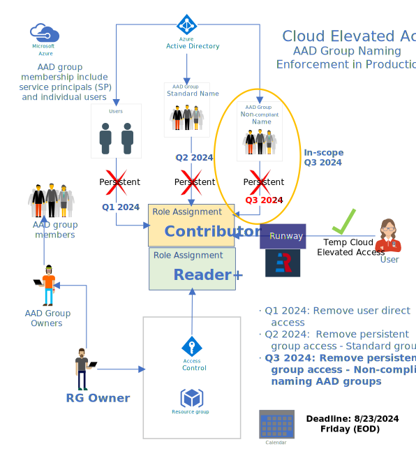

# Remove Persistent Contributor Role Assignment to Production Resource Group

Last revision: 9/6/2024

### Implementation Logs

* **8/28/2024**, Production run: Removing non-standard persistent Contributor access to production resource group.
* **8/23/2024**, The deadline for users to remediate their access.

### Table of Contents
- The Scope
  - The Changes (Q3 2024)
    - Azure Side Discovery
    - Sonrai (CSPM) 
- The PowerShell Script
  - `PowerShell` Version and `Az` Module Version
  - Install PowerShell 7 (Recommended)
  - Install Az Module
  - Set up `Env`
- Remove-AaAzureContributorAccess.ps1
  - How to Run the Script
  - The Workflow
  - The Custom Functions
  - Standard PS Function Naming Conventions
- The Communications
  - 8/22/2024
- Post Implementation Notes
  - Script: `Remove-AaAzureContributorAccess.ps1`
  - Azure AD Group Member Types in PROD
- How to Manually Validate Contributor Access through Azure Portal
- Sonrai Query (Input)
  - Input File Metadata

## The Scope



#### The Changes (Q3 2024)

##### Azure Side Discovery

- AAD Group Member Types
  - Nested Group
  - Service Principal
  - Z Account (User)
  - User
- Role Classification
  - Job function roles
  - Privileged roles
  - Permanent roles
  - Time-bound roles (Preview)
- Get-AzRoleAssignment:
  - `.RoleDefinitionName`: 
    Returns `string "Contributor"` or 
    `object["Contributor", "Contributor"]`.
- Deduplicate Records
  - Unique Key: (Scope + AAD Group ID)

##### Sonrai (CSPM)

- Sonrai Query Tuning 8/6/2024 to include `Member Only + SP`
  - No removal of Contributor access if SP is inside
  - Inform the group owner to remediate AAD group:
    - Non-standard: AAD group naming convention
    - Remove Persistent Contributor Access
- Policy Scope Update: (Member + SP) Removed many nested resource meta-data
- (TO-DO) Swimlane: Dynamic update subscriptions

## The PowerShell Script

The removal script is written in `PowerShell` and it leverages `Az` module to perform the actual removal of Contributor access.

#### `PowerShell` Version and `Az` Module Version

[Differences between Windows PowerShell 5.1 and PowerShell 7.x](https://learn.microsoft.com/en-us/powershell/scripting/whats-new/differences-from-windows-powershell?view=powershell-7.4)

> There are few differences in the PowerShell language between Windows PowerShell and PowerShell. The most notable differences are in the availability and behavior of PowerShell cmdlets between Windows and non-Windows platforms and the changes that stem from the differences between the .NET Framework and .NET Core.

> Windows PowerShell 5.1 is built on top of the .NET Framework v4.5. With the release of PowerShell 6.0, PowerShell became an open source project built on .NET Core 2.0. Moving from the .NET Framework to .NET Core allowed PowerShell to become a cross-platform solution. PowerShell runs on Windows, macOS, and Linux.

#### Install PowerShell 7 (Recommended)

See the installation documentation for your OS.

[Install PowerShell on Windows, Linux, and macOS](https://learn.microsoft.com/en-us/powershell/scripting/install/installing-powershell?view=powershell-7.4)

```powershell
# Verify installation
$PSVersionTable

Name                           Value
----                           -----
PSVersion                      7.4.5
PSEdition                      Core
GitCommitId                    7.4.5
OS                             Microsoft Windows 10.0.22631
Platform                       Win32NT
PSCompatibleVersions           {1.0, 2.0, 3.0, 4.0…}
PSRemotingProtocolVersion      2.3
SerializationVersion           1.1.0.1
WSManStackVersion              3.0
```

#### Install Az Module

Open a `PowerShell` terminal with `Run as Administrator`

```powershell
# Install Az module
Install-Module -Name Az -Repository PSGallery -AllowClobber -Scope AllUsers -Force

# Verify installation
Get-InstalledModule Az

# Output
Version              Name                                Repository           Description
-------              ----                                ----------           -----------
12.3.0               Az                                  PSGallery            Microsoft Azure…

# Check Execution Policy
Get-ExecutionPolicy -List

# Verify it's RemoteSigned
Scope ExecutionPolicy
        ----- ---------------
MachinePolicy       Undefined
   UserPolicy       Undefined
      Process       Undefined
  CurrentUser       Undefined
 LocalMachine    RemoteSigned
```

#### Set up `$Env`

The location of a PowerShell 7 profile depends on the host application and whether it's for all users or a specific user.

The profile is located at `$HOME\Documents\PowerShell\` on Windows, and `~/.config/powershell/` on Linux and macOS.

The profile script for `Visual Studio Code (VS Code)` is `Microsoft.VSCode_profile.ps1`

> A PowerShell profile is a script that executes when PowerShell starts, customizing the environment with commands, aliases, functions, variables, modules, and PowerShell drives. 

For Windows PowerShell 5.1:
Path: `(Windows) C:\Users\[user_name]\Documents\WindowsPowerShell`

For PowerShell 7.4:
Path: `(Windows) C:\Users\[user_name]\Documents\PowerShell`

File: `Microsoft.PowerShell_profile.ps1`
```powershell
# Service Principal
$Env:ARM_CLIENT_ID=""
$Env:ARM_CLIENT_SECRET=""
$Env:ARM_SUBSCRIPTION_ID=""
$Env:ARM_TENANT_ID=""
```

## Remove-AaAzureContributorAccess.ps1

#### How to Run the Script

Script: `Remove-AaAzureContributorAccess.ps1`

In PowerShell terminal:

```powershell
# Usage
.\Remove-AaAzureContributorAccess.ps1 -InputFile <Sonrai CSV File> [-WetRun] [-UserPrincipal]

# Examples
.\Remove-AaAzureContributorAccess.ps1 -InputFile ".\AA sonrai.csv" # By default, Dry Run is performed and Service Principal is used
.\Remove-AaAzureContributorAccess.ps1 -InputFile ".\AA sonrai.csv" -WetRun
.\Remove-AaAzureContributorAccess.ps1 -InputFile ".\AA sonrai.csv" -UserPrincipal
```

```emaillists
# Examples of AAD group, Subscription, Resource Group Email lists
# Get AAD Contributor Owners example
.\remove-AaAzureContributorAccess.ps1 -InputFile “sonrai.csv” -AADContOwners

# Get RG Owners example
 .\remove-AaAzureContributorAccess.ps1 -InputFile “sonrai.csv” -RGAADOwners

# Get Subscription Owners example provide a subscription list format
## Name                  | Id
aa-io-hcm-adv-prod-spoke | 27f66db2-d89f-4789-ac37-4075aea99c87
aa-tnt-sandbox-nonprod-spoke | 5e06cd07-b7c5-42c1-86fb-ca1cfa4e337f
aa-corp-payroll-nonprod-spoke | a350b9a6-536a-464e-a2ec-d38530f95b2d

.\remove-AaAzureContributorAccess.ps1 -InputFile “sonrai.csv” -SubOwners

````

You can Set Alias for this script.

```powershell
Set-Alias -Name rmca -Value ".\Remove-AaAzureContributorAccess.ps1"

# To verify the alias
Get-Alias -Name rmca

# Example of using the alias
rmca -InputFile "AA - Group Contributor (Custom)  - Members (AA-Custom) -RG results - 2024-08-06T15_10_21.csv"
```

#### The Workflow


```powershell
Function Main {
    Write-Host "***=- Welcome to Remove-AaAzureContributorAccess -=***" -ForegroundColor DarkGreen -BackgroundColor White
    $VERSION=Get-AaDateTimeAsString

    # ------------------------------------------------
    # 1. Take arguments
    # ------------------------------------------------
    Write-Host "** Params: (Input: $InputFile, Wet-run: $WetRun)"

    # Input file from Sonrai
    $csvFile=$InputFile
    if (-Not ($csvFile -Match ".csv")) {
        throw "InputFile must be a csv file."
    }

    # csvData is an Object
    $csvData = Read-AaCSV -CsvFile $csvFile

    # Get report output file path
    $outPath=($InputFile.SubString(0, $InputFile.Length - 4))
    $reportPath = -join($outPath, "_OUT_", $VERSION, ".csv")

    Write-Host "** Input-Csv-File: $csvFile, Output-Path: $reportPath, Wet-Run: $WetRun)"

    # ------------------------------------------------
    # 2. Connect to Azure
    # ------------------------------------------------
    # Disconnect the current AzContext if any, and use SP by default
    # Optionally, can use -UserPrincipal switch
    Connect-AaAzure -Force

    # ------------------------------------------------
    # 3. Process CSV
    # ------------------------------------------------
    $results, $rowCount, $aadGroups = Process-AaSonraiCSV -CsvData $csvData

    # ------------------------------------------------
    # 4. Process AAD Groups and Members
    # ------------------------------------------------
    $allMembers = [List[PSCustomObject]]::new()
    foreach($group in $aadGroups) {
        foreach($member in $group) {
            $allMembers.Add($member)
        }
    }
    # Output to a CSV file
    $allMembers | Export-Csv -Path ".\aad-groups-all-members-$VERSION.csv" -NoTypeInformation

    # ------------------------------------------------
    # 5. Remove Contributor Role Assignment by default
    # ------------------------------------------------
    $count = 0
    foreach($record in $results) {
        $count ++
        Write-Host "==> Record # $count"
        $res = $null
        # Real production run, must use '-WetRun' switch
        if ($WetRun) {
            $res = Remove-AaAzureRoleAssignment -Principal $record.AADGroupID -Scope $record.Scope `
                -SPAccount $record.SPAccount -ZAccount $record.ZAccount -WetRun
        }
        else { # Dry run by default
            $res = Remove-AaAzureRoleAssignment -Principal $record.AADGroupID -Scope $record.Scope `
                -SPAccount $record.SPAccount -ZAccount $record.ZAccount
        }
        $record.Status = $res.Status
        $record.Roles = $res.Roles
    }

    # ------------------------------------------------
    # 6. Print processing info
    # ------------------------------------------------
    Write-Host "** Total CSV Records Read: $rowCount" -ForegroundColor DarkGreen -BackgroundColor White
    Write-Host "** Total Processed Count: $($results.Count)" -ForegroundColor DarkGreen -BackgroundColor White

    # ------------------------------------------------
    # 7. Export CSV report
    # ------------------------------------------------
    $results | Export-Csv -Path $reportPath -NoTypeInformation
    Write-Host "** Output Report in $reportPath"

    # ------------------------------------------------
    # 8. Disconnect from Azure when the job is done
    # ------------------------------------------------
    Disconnect-AaAzure
}
```
- Execute `Remove-AaAzureContributorAccess.ps1` with required params in PowerShell terminal
- Read a CSV file generated by Sonrai Query
- Connect to Azure
- Process the CSV file to transform data into a correct format.
- Remove duplicate records from the input file based on the unique `key = scope + aad_group_id`. Here the `scope = subscription_id + resource_group_name`.
- After deduplication, check and see if the AAD group exists.
- Check and see if the AAD group contains any service principal(s) or Z-account(s) including nested groups. The check goes recursively to all the nested groups to ensure detecting all SP or Z-account in a group. If SP or Z-account member is found, the program sets the member type as a SP or Z-account.
- Export the AAD groups all members to a CSV file for auditing purpose.
- Check to see if the `Contributor` role assignment to production resource group (RG) exists in the correct policy scope.
- Revoke the `Contributor` role assignment to production RG if it's in the correct policy scope.
- Skip the `Contributor` role assignment removal if the AAD group contains any service principal or z-account.
- Record the transactions, and report final status in a CSV file.
- Finally, disconnected from Azure

Please note, that role assignment definition name can be a single string `"Contributor"`, or an object array `["Contributor", "Contributor"]` due to different scopes.

#### The Custom Functions

* Get-AaDateTimeAsString
* Read-AaCSV
* Connect-AaAzure
* Disconnect-AaAzure
* Is-AaMemberTypeValid
* Get-AaAzureADMemberType
* Get-AaAzureADGroupMember
* Check-AaAzureADGroupContainsSP
* Is-AaAzureAssignedRoleInScope
* Process-AaSonraiCSV
* Remove-AaAzureRoleAssignment
* Main

#### Standard PS Function Naming Conventions

- Pattern: `<Verb>-<PreFix><Noun>`
  [Approved Verb](https://learn.microsoft.com/en-us/powershell/scripting/developer/cmdlet/approved-verbs-for-windows-powershell-commands?view=powershell-7.4)

- Azure: `Get-AzADGroupMember`
- GaaS:  `Get-AaAzureADGroupMember`

## The Communications

#### 8/22/2024 (Day before the deadline)
```
Hello All,

This is a reminder that August 23, 2024 (This Friday) is your last day to remediate "persistent nonstandard AAD group Contributor role assignments for production Resource Groups (RG) ".

To assist you, we have compiled two lists as attachments.
- contributor-role-assignment.xlsx
- aad-groups-all-members.xlsx

Resource Group Owners

Please take a look at "contributor-role-assignment.xlsx" and  "aad-groups-all-members.xlsx".

* For Contributor role assignment (access) please see "AADGroupName" and "ResourceGroupName" columns and check the "Status" column for expected results. There are 4 possible status results:
  - "Contributor Access To Be Removed.": Contributor Access will be removed after August 23, 2024.
  - "No Action: No matching Contributor role assignment found.": You're good. No action. The Contributor access might have been remediated/removed by the team.
  - "Remediation Action Required: AAD Group contains Service Principal.": Please remove the human users out of this AAD group, and make sure the AAD group follows the AAD group's naming convention. We will not remove the Contributor access to the resource group this time, but remediation action is recommended.
  - "Remediation Action Required: AAD Group contains Z Account.": Please remove the human users from this AAD group, and make sure the AAD group follows the AAD group naming convention. We will not remove the Contributor access to the resource group this time, but remediation action is recommended.
* If you have a "legacy" Z account, please consider migrating it to an Azure Service Principal account (SPN).
* If you have an Azure Service Principal account (SPN) or Z account, please consider removing all human users out of the AAD Contributor group so that only SPN(s) or Z account(s) stay in the desired AAD Contributor group.
* All human users should stay in an AA-Reader+ group for persistent access to production resource groups. If temporary Contributor access is required for production need, please use the runway process to elevate your group's access.

AAD Group Owners and Members

Please take a look at the "aad-groups-all-members.xlsx".

* Your Persistent Contributor access to Production Resource Groups will be impacted and removed after August 23, 2024.
* Please work with the Resource Group Owners for your production access needs.
* If temporary Contributor access is required, please  use the runway process to elevate your group's access.
* Please follow the AAD group's naming convention for your AAD group. Remediate it if necessary.

Please reach out to our team (DL_GaaS@aa.com) if you have any questions or concerns.

Thank you for your attention to this matter. Your cooperation is greatly appreciated.

Governance as a Service (GaaS) team
```

## Post Implementation Notes

8/28/2024

#### Script: `Remove-AaAzureContributorAccess.ps1`

- Added `DryRun | WebRun` capability so that we can test our removals in the production environment without real impact. 
- Added the `Policy Scope` check in `Is-AaAzureAssignedRoleInScope` to ensure a role assignment in the proper `Scope`. 
- Fixed the `Get-AaAzureADGroupMember` logic during De-Duplicate process so that there is no missing AAD group and/or member for auditing and validation purpose only. Use `Key = Scope + AADGroupId in HashSet` to deduplicate.
- Categorize the Memeber Types:
  - user
  - servicePrincipal
  - zAccount
  - group 

#### Azure AD Group Member Types in PROD

There are four possible AAD group member types in PROD. The criteria for classification as follows:

- User by `OdataType=user`
- ServicePrincipal by `OdataType=servicePrincipal`
- Z-Account: User with no `JobTitle` and `OdataType=user`
- Group: Nested group, by `OdataType=group`

These criteria are subject to change. We will communicate to Z-Account application teams for remediation in Sept. 2024.

## How to Manually Validate Contributor Access through Azure Portal

#### Check `Contributor` Role Assignment

- Login to Azure Portal
- Search `Resource Group` (RG)
- Find your RG
- On the left menu, select `Access control (IAM)`
- On the right side of the screen, select `Check access`
- Under `Check access`, select Find `User, group, or service principal`
- Enter the `AAD Group Name`, and click on it
- Under `Current role assignment`, check and see if `Contributor` is listed under `Role`. If so, this `AAD Group` might be the target for remediation.
- Next, we need to check and see if the `AAD Group` contains any service principal or Z account. For Q3 2024, if an `AAD Group` contains a service principal or Z account, we skip the `Contribuor` role assignment removal. We will remediate it later.

#### Check `Service Principal` or `Z Account` in an `AAD Group`

- In Azure Portal, search `Microsoft Entra ID`.
- On the left menu, select `Group`, and enter the `AAD Group` name.
- Click on the `AAD Group`, and click the `Members` on the left menu.
- If any of the `Members` is a `Service Principal` or `Z account`, we skip the `Contributor role assingment` removal in production this time and will follow up and remediate them post implementation.
- Take a note, and mark this `AAD Group` for non-compliance, and follow-up.

## Sonrai Query (Input)

- [AA - Group Contributor (Custom)  - Members (AA-Custom) -RG](https://app.sonraisecurity.com/App/Search?searchId=3dbfcc6c-7702-452c-a20f-5c796ffcccf2&view=results)
- **Input File CSV Metadata**

> Policy Type,	Resource Name,	Identity Name,	Identity AAID,	Identity Email,	Identity Principal ID,	Identity Manager,	Identity Manager Email.	Resource Group ID,	Policy Scope,	Policy Name,	Tenant Name,	Subscription Name,	Resource Group Name,	Management Group Names

## How to run the script (locally) and getting access.
  - Make sure all the env variables are setup locally
  - Create a AAD group that does not comply with the AAD group naming standards
    ex. AAD_TESTING_<Name> in developer.aa.com to create the AAD group for testing
    - add the direct users that will flag the script to delete role assignments in portal
    - add the SPN to the aad grp that will flag the script to not delete the role assignments in portal
  - Get the resource group created by the GaaS MG owners.
  - Activate the RG role to add the role assignments.
  - Create the SPN using developer.aa.com portal.
  - Login to Azure portal and assign SP role to AA-UserAccess-ReadDelete_Dev
  - Add the AAD_TESTING_<Name> as direct contributor access (permanent) active 
  - **** get the access to look at the high level MG group read access ****
      [Read Access] New member read access at the MG level · Issue #1759 · AAInternal/governance-as-a-service (github.com)
  - Sample data:
    | PolicyType | ResourceName | IdentityName | IdentityAAID | IdentityEmail | IdentityPrincipalID	| IdentityManager | IdentityManagerEmail| ResourceGroupID	| PolicyScope | PolicyName | TenantName	| SubscriptionName |	ResourceGroupName |	ManagementGroupNames |
    | -----| ------ |  -----| ------ |  -----| ------ |  -----| ------ |  -----| ------ |  -----| ------ |  -----| ------ |  -----|
     | Group	| AAD_TESTING_SWETHA |	Name | id | email | principalid |  | | rgid | policyscope	| Contributor| AmericanAirlines,Inc. |<sub> | <rg> | NON-PRODUCTION-MG,AA_GLOBAL-MG,Tenant Root Group |

    


